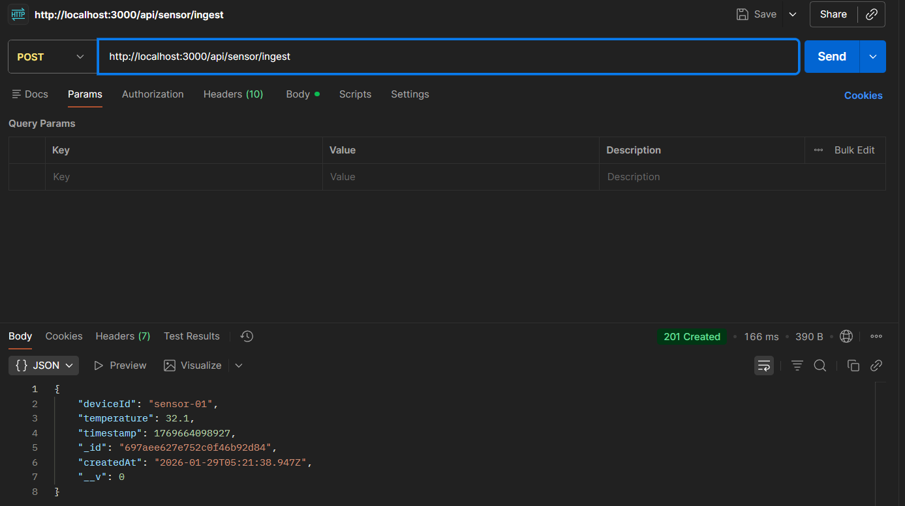
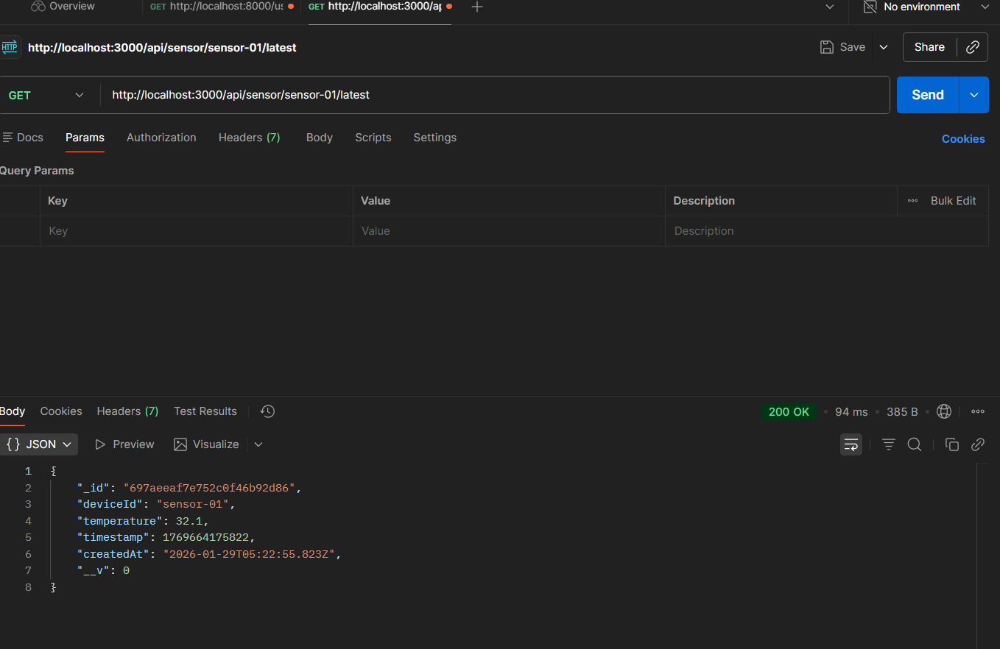
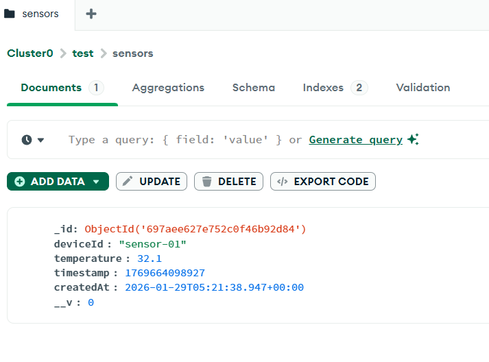
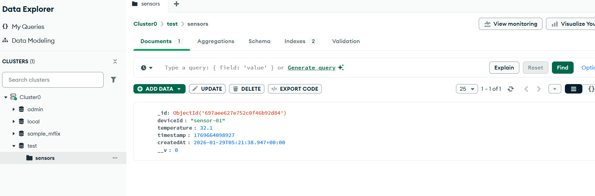

# IoT Sensor Temperature Backend (Node.js + MongoDB)

- A Node.js backend service that ingests IoT sensor temperature readings, stores them in MongoDB Atlas, and exposes APIs to retrieve the latest reading per device.

- Built using Node.js, Express, and Mongoose with optional MQTT integration.

## Features

1. Ingest IoT temperature readings via REST API

2. Store sensor data in MongoDB Atlas

3. Retrieve latest temperature reading for a device

4. Field validation for required data

5. Auto-assign current timestamp if missing

6. (Bonus) MQTT subscriber for real-time sensor ingestion

## Tech Stack

- Node.js (v18+ / v20 LTS)

- Express.js

- MongoDB Atlas

- Mongoose

- MQTT.js (Bonus)

## Database Schema

- SensorReading

- deviceId (String, required)

- temperature (Number, required)

- timestamp (Number, epoch ms)

- createdAt (Date, default: now)

## Setup Instructions

1. **Clone the repository**
2. **Install dependencies:**
   ```bash
   npm install
   ```
3. **Configure environment variables:**
   - Copy `.env` and set your `MONGODB_URI` (MongoDB Atlas connection string)
   - Set `PORT` if needed (default: 3000)
4. **Start the server:**
   ```bash
   node server.js
   ```

## API Endpoints

### 1. Ingest Sensor Data
- **POST** `/api/sensor/ingest`
- **Body:**
  ```json
  {
    "deviceId": "sensor-01",
    "temperature": 32.1,
    "timestamp": 1705312440000
  }
  ```
- **Notes:**
  - `deviceId` (string) and `temperature` (number) are required.
  - `timestamp` is optional (defaults to current time).
- **Response:**
  - 201 with saved document
  - 400 for validation errors

## Postman – POST API



### 2. Get Latest Sensor Data
- **GET** `/api/sensor/:deviceId/latest`
- **Response:**
  - 200 with latest document
  - 404 if not found


### Postman – GET API



### MongoDB Atlas

<p align="center">
  
  
</p>


Made by Jainam Bheda

Thank you !!!
